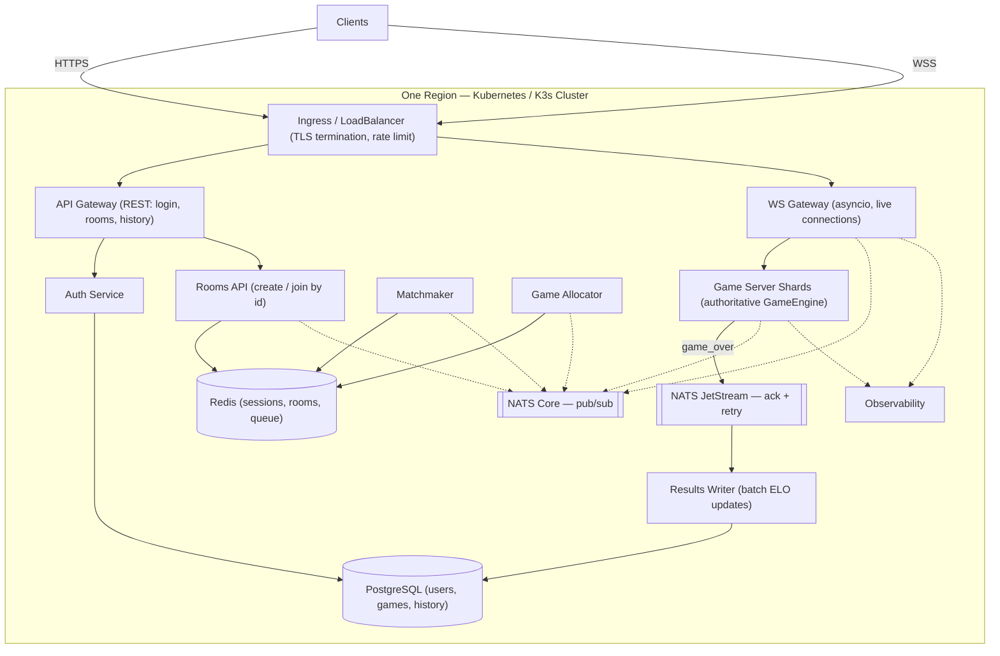
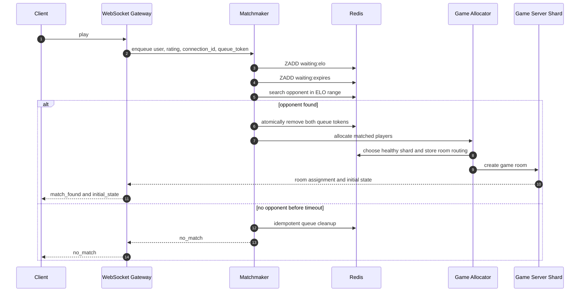
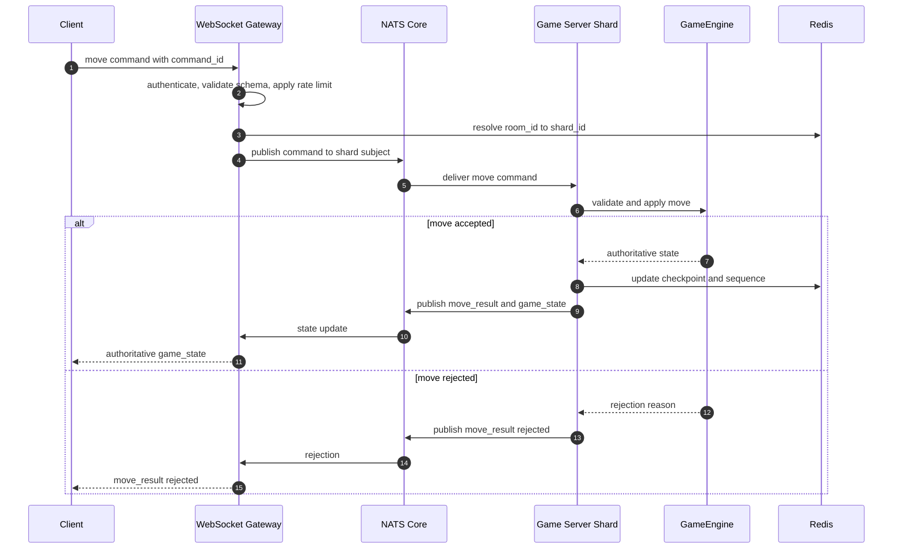
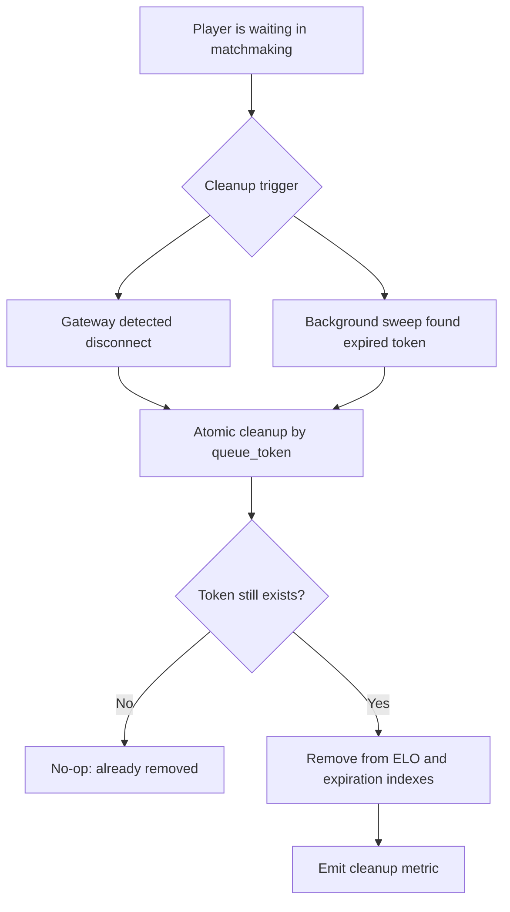

# Kung Fu Chess — Server Design

**גרסה:** 1.0  
**סטטוס:** Proposed Architecture  
**עודכן:** 29.07.2026  
**מטרה:** תכנון ארכיטקטורת Production לצד מסלול מימוש קטן, הדרגתי ועובד

---

## 1. תקציר מנהלים

Kung Fu Chess הוא משחק שחמט בזמן אמת. השרת חייב לנהל חיבורים ארוכי־חיים,
שידוכים לפי דירוג, חדרים, מצב לוח סמכותי, ניתוקים ועדכון תוצאות — בלי לאפשר
ללקוח לקבוע את חוקי המשחק.

הארכיטקטורה מפרידה בין ארבעה סוגי אחריות:

1. **גישה ותקשורת** — Ingress, API Gateway ו-WebSocket Gateway.
2. **תיאום והקצאת עבודה** — Matchmaker, Redis ו-Game Allocator.
3. **הרצת משחקים** — Game Server Shards שמחזיקים `GameEngine` סמכותי.
4. **שמירה ותפעול** — NATS JetStream, Results Writer, PostgreSQL ו-Observability.

> [!IMPORTANT]
> ה-Client וה-Gateways אינם מחליטים אם מהלך חוקי.  
> `GameEngine` שרץ ב-Game Server Shard הוא ה-Single Source of Truth לחוקי
> המשחק ולמצב הלוח הסמכותי.

---

## 2. מצב נוכחי לעומת ארכיטקטורת היעד

הפרדה זו חשובה כדי לא להציג רכיבים שעדיין לא מומשו כאילו הם כבר קיימים.

| תחום | המימוש הנוכחי | יעד Production |
|---|---|---|
| WebSocket | שרת Python יחיד המבוסס `asyncio` | מספר WS Gateways ו-Game Server Shards |
| API | Login, Rooms ו-Moves עוברים בפרוטוקול WebSocket | API Gateway ל-REST ו-WS Gateway לזמן אמת |
| Matchmaking | תור מקומי בזיכרון | שירות Matchmaker עם Redis Sorted Sets |
| חדרים | `RoomManager` מקומי בתהליך | Game Allocator ורישום חדרים משותף ב-Redis |
| מצב משחק | `GameSession` בזיכרון | GameEngine בזיכרון ה-Shard עם checkpoint/recovery |
| מידע קבוע | SQLite | PostgreSQL מנוהל |
| תוצאות | עדכון ELO ישיר | `game_over` עמיד ב-JetStream ו-Results Writer |
| תפעול | קובצי לוג מקומיים | Logs, Metrics, Traces, Health Checks ו-Alerts |

המימוש הנוכחי הוא **Modular Monolith עובד**. הארכיטקטורה המתוארת בהמשך היא
יעד התפתחותי, ולא דרישה לפצל מיד כל רכיב ל-Microservice נפרד.

---

## 3. עקרונות תכנון

### 3.1 Authoritative Server

- הלקוח שולח כוונה: למשל `move WPe2e4`.
- ה-Gateway מאמת זהות, מבנה הודעה ומגבלות קצב בלבד.
- ה-Game Server Shard מפעיל את `GameEngine`.
- רק ה-State שהשרת משדר נחשב למצב הרשמי.

### 3.2 הפרדת Hot Path מ-Persistence

הנתיב החם של מהלך אינו ממתין לכתיבה מלאה ל-PostgreSQL:

1. ה-Shard מאמת את המהלך.
2. מצב המשחק מתעדכן בזיכרון.
3. התוצאה משודרת לשחקנים.
4. אירוע עמיד נשלח ל-NATS JetStream.
5. Results Writer שומר את התוצאה במסד הנתונים.

### 3.3 מידע זמני לעומת מידע קבוע

- **Redis:** Sessions, Presence, Matchmaking Queue, Room Routing, Reconnect
  Tokens ו-checkpoints קצרים.
- **PostgreSQL:** Users, password hashes, games, results, rating history
  ו-move history לפי צורך.
- **NATS JetStream:** אירועים עמידים שעדיין לא נכתבו למסד הנתונים.

### 3.4 Idempotency

פעולות שעלולות להגיע יותר מפעם אחת כוללות מזהה ייחודי:

- `command_id` לפקודת שחקן.
- `game_id` למשחק.
- `result_event_id` לאירוע סיום.
- `queue_token` לכניסה לתור.

כך Retry או Consumer כפול אינם גורמים למהלך או לעדכון ELO כפול.

---

## 4. תרשים הארכיטקטורה



**מקרא:** קו רציף מייצג זרימת נתונים; קו מקווקו מייצג Control Plane,
תיאום או Telemetry. הפריסה מציגה את Clients למעלה, את שערי הכניסה מתחתיהם,
את שירותי המשחק במרכז ואת שכבת הנתונים בתחתית.

### החלטת Messaging

- **NATS Core** מתאים להודעות פנימיות קצרות ומהירות כאשר אין צורך בשמירה.
- **NATS JetStream** מתאים לאירועים שאסור לאבד, כגון `game_over`.
- **Redis Pub/Sub** יכול לשמש בגרסת MVP, אך ביעד הסופי עדיף לבחור מנגנון
  Messaging מרכזי אחד כדי לצמצם מורכבות תפעולית.

---

## 5. רכיבי המערכת

### 5.1 Ingress / Load Balancer

**מיקום:** נקודת הכניסה החיצונית לקלאסטר, מנוהלת באמצעות תשתית הענן או
Ingress Controller.

**אחריות:**

- TLS Termination עבור HTTPS ו-WSS.
- ניתוב REST אל API Gateway ו-WebSocket אל WS Gateway.
- Rate Limiting בסיסי והגנת DDoS/WAF.
- Health Checks וניתוב רק ל-Pods בריאים.
- Connection Draining בזמן Deployment כדי לא לנתק שחקנים מיד.

ה-Ingress אינו מכיר חוקי משחק ואינו מחזיק State עסקי.

### 5.2 API Gateway

**מיקום:** Pods נפרדים בתוך Kubernetes.

**אחריות:**

- Login והרשמה.
- ניהול חשבון ופרופיל.
- יצירת חדרים וחיפוש היסטוריה בגרסת היעד.
- קריאת דירוגים ותוצאות.
- אימות בקשות REST והנפקת Session/Access Token.

ה-API Gateway הוא Stateless ככל האפשר, ולכן ניתן להוסיף או להסיר Pods בהתאם
לעומס.

### 5.3 WebSocket Gateway

**מיקום:** Pods ייעודיים בתוך Kubernetes, המבוססים על `asyncio`.

**אחריות:**

- החזקת אלפי חיבורי WebSocket ארוכי־חיים.
- אימות Token בתחילת החיבור.
- Schema Validation, מגבלת גודל הודעה ו-Rate Limiting.
- זיהוי Disconnect והחזרת Connection State.
- ניתוב פקודות אל ה-Game Shard שמחזיק את החדר.
- שליחת State Updates, Countdowns ותוצאות אל הלקוחות.

ה-Gateway אינו מפעיל את חוקי השחמט. הפרדה זו מונעת מעומס Login או REST לפגוע
בלולאות המשחק הפעילות.

### 5.4 Matchmaker

**מיקום:** Service עצמאי בתוך Kubernetes.

**אחריות:**

- קליטת שחקנים המחפשים משחק.
- התאמה לפי טווח ELO וכללי זמן המתנה.
- הסרת שחקנים שהתנתקו או שפג תוקפם.
- שליחת הזוג שנמצא ל-Game Allocator.

Redis מחזיק שני אינדקסים נפרדים:

```text
waiting:elo      -> Sorted Set לפי דירוג ELO
waiting:expires  -> Sorted Set לפי expires_at
```

אין להסתמך על Sorted Set יחיד גם לדירוג וגם לזמן, מכיוון שלכל Member יש Score
יחיד בלבד.

### 5.5 Game Allocator

**מיקום:** Service קטן ו-Stateless בתוך Kubernetes.

**אחריות:**

- קבלת שני שחקנים מה-Matchmaker.
- בחירת Game Server Shard בריא עם קיבולת פנויה.
- יצירת `room_id` ו-`game_id`.
- שמירת המיפוי `room_id -> shard_id` ב-Redis.
- החזרת פרטי הניתוב ל-WS Gateways.

הפרדת השידוך מההקצאה מאפשרת Scale אופקי ומבוקר. היא אינה מבטיחה “סקייל
אינסופי”; הקיבולת עדיין תלויה במספר החיבורים, CPU, זיכרון ורוחב הפס.

### 5.6 Game Server Shards

**מיקום:** צי Containers מבודדים בתוך Kubernetes.

**אחריות:**

- הרצת `GameEngine` הסמכותי.
- אחזקת מספר חדרים פעילים בזיכרון.
- אימות Role, Color וחוקיות מהלך.
- קידום שעון המשחק ותנועות בזמן אמת.
- הפצת State Authoritative דרך ה-WS Gateway.
- הפקת אירוע `game_over`.

כל חדר נמצא בבעלות Shard יחיד בכל רגע. Lease עם Fencing Token מונע מצב שבו
שני Shards מאמינים שהם בעלי אותו חדר.

מכיוון שהמשחקים קצרים, State חם נשמר בזיכרון לביצועים. עם זאת, נפילת Shard
ללא Checkpoint עלולה לאבד משחק פעיל; לכן Redis או Event Stream שומרים
Checkpoint מינימלי המאפשר Reconnect או Recovery לפי מדיניות המוצר.

### 5.7 NATS JetStream ו-Results Writer

**מיקום:** NATS ו-Results Writer רצים כשירותים מנוהלים או כ-Workloads
בקלאסטר.

**אחריות:**

- ה-Shard מפרסם `game_over` ל-Stream עמיד.
- JetStream שומר את האירוע עד לקבלת ACK.
- Results Writer צורך אירועים ב-Consumer Group.
- כתיבת Game Result ועדכון ELO מתבצעים בטרנזקציה אחת.
- `result_event_id` עם Unique Constraint מונע עדכון כפול.

ניתן לבצע Batch לכתיבת היסטוריה ו-Analytics. לעומת זאת, עדכון ELO הדורש
עקביות בין שני שחקנים חייב להישאר טרנזקציוני.

### 5.8 PostgreSQL

**מיקום:** Database מנוהל עם Persistent Storage, רצוי מחוץ לקלאסטר
האפליקטיבי.

**מידע נשמר:**

- Users.
- Password hashes ו-salts.
- Games ו-Results.
- Rating History.
- Move History, אם נדרש Replay.
- Audit Events עסקיים.

> [!NOTE]
> סיסמה אינה “מוצפנת” ב-PBKDF2 אלא נשמרת כ-Hash חד־כיווני עם Salt ופרמטרי
> עבודה מתאימים.

### 5.9 Observability

**אחריות:**

- Structured Logs עם `correlation_id`, `user_id`, `room_id` ו-`game_id`.
- Metrics: חיבורים, הודעות לשנייה, זמן שידוך, Latency ואחוז שגיאות.
- Distributed Tracing בין Gateway, Matchmaker, Shard ו-Results Writer.
- Readiness/Liveness Checks.
- Dashboards, Alerts ו-Load Tests.

אסור לרשום סיסמאות, Tokens או מידע רגיש ללוגים.

---

## 6. זרימת שידוך והקצאת משחק



### דרישות אטומיות

מציאת יריב והסרת שני השחקנים מהתור חייבות להתבצע באמצעות Redis Transaction
או Lua Script. אחרת שני Matchmaker Workers עלולים לשדך אותו שחקן פעמיים.

---

## 7. זרימת מהלך בזמן משחק



---

## 8. ניתוקים ו-Timeouts בתור ההמתנה

### 8.1 Disconnect רגיל

ה-WS Gateway הוא בעל החיבור הפיזי. כאשר הוא מזהה ניתוק:

1. הוא שולח ל-Matchmaker בקשת הסרה עם `queue_token`.
2. ה-Matchmaker מבצע `ZREM` משני האינדקסים.
3. הפעולה Idempotent; אם השחקן כבר הוסר, התוצאה היא No-op.

### 8.2 Background Sweep

Gateway עלול לקרוס לפני ששלח בקשת הסרה. לכן Worker תקופתי מחפש Entries
שפג תוקפם:

```text
ZRANGEBYSCORE waiting:expires -inf now LIMIT 0 batch_size
```

עבור כל `queue_token` שפג:

1. הסרה אטומית מ-`waiting:expires`.
2. הסרה מ-`waiting:elo`.
3. מחיקת Queue Metadata.
4. פרסום Metric של Expired Queue Entry.

### 8.3 מניעת Race לאחר Rejoin

אין להסיר לפי `user_id` בלבד. אם משתמש התנתק ומיד נכנס מחדש, Sweeper ישן
עלול למחוק את הכניסה החדשה. לכן כל כניסה לתור מקבלת `queue_token` חדש, וכל
פעולת Cleanup בודקת את אותו Token.



---

## 9. ניתוק במהלך משחק

ניתוק במהלך משחק שונה מניתוק בתור:

1. WS Gateway מעדכן Presence ומודיע ל-Shard.
2. ה-Shard מתחיל Grace Period, לדוגמה 20 שניות.
3. היריב והצופים מקבלים `disconnect_countdown`.
4. חיבור מחדש עם Reconnect Token מחזיר את השחקן לאותו `game_id`.
5. אם הזמן פג, ה-Shard מבצע Auto-Resign סמכותי.
6. `game_over` נשלח ל-JetStream.
7. Results Writer שומר את התוצאה ומעדכן ELO.

Timer המשחק נמצא בבעלות ה-Shard, ולא ב-Gateway, כדי ששינוי Gateway לא ישנה
את תוצאת המשחק.

---

## 10. מודל נתונים מוצע

### PostgreSQL

```text
users
  id, username, password_hash, password_salt, created_at

games
  id, room_id, white_user_id, black_user_id, status,
  winner_user_id, started_at, ended_at

rating_history
  id, game_id, user_id, rating_before, rating_after, created_at

game_events
  id, game_id, sequence, event_type, payload, created_at
```

### Redis

```text
session:{session_id}             -> user/session metadata
presence:{user_id}               -> gateway_id, connection_id, expires_at
waiting:elo                      -> queue_token sorted by ELO
waiting:expires                  -> queue_token sorted by expiration time
queue:{queue_token}              -> user_id, rating, gateway_id
room:{room_id}:route             -> shard_id, lease_token
game:{game_id}:checkpoint        -> serialized state, sequence, TTL
shard:{shard_id}:capacity        -> active_rooms, heartbeat
```

---

## 11. אבטחה

- HTTPS/WSS בלבד עם TLS 1.2 ומעלה.
- Access Tokens קצרי־חיים ו-Reconnect Tokens מוגבלים למשחק יחיד.
- Authorization לפי `user_id`, `room_id` ו-Role.
- PBKDF2 עם Salt ייחודי ופרמטרים שמורים לצד ה-Hash.
- Schema Validation לכל הודעת JSON.
- הגבלת Payload ו-Rate Limit פר User/IP/Connection.
- Secrets נשמרים ב-Secrets Manager ולא בקוד או ב-Docker Image.
- הצפנה At Rest ל-PostgreSQL, Redis Snapshots וגיבויים.
- Log Redaction עבור Tokens, Passwords ו-PII.

---

## 12. זמינות ו-Failover

| כשל | מנגנון זיהוי | תגובה |
|---|---|---|
| WS Gateway נופל | Kubernetes Health Check | Gateway חלופי; Clients מתחברים מחדש |
| Matchmaker נופל | Readiness/Liveness | Worker חדש ממשיך מתורי Redis |
| Game Shard נופל | Heartbeat ו-Lease expiry | Allocator מקצה Recovery Worker או מסיים לפי מדיניות |
| Redis Node נופל | Redis Cluster Monitoring | Replica Promotion ו-Rebalance |
| PostgreSQL Primary נופל | Managed DB Monitoring | Multi-AZ Failover |
| Results Writer נופל | Consumer Health | JetStream שומר אירועים עד חזרתו |
| עומס Reconnect | Connection Rate Metric | Exponential Backoff, Jitter ו-Admission Control |

---

## 13. Docker Compose — גרסה קטנה ועובדת

השלב הבא אינו חייב לכלול Kubernetes. גרסת MVP מקומית יכולה לכלול:

```text
app               Python API + WebSocket + GameEngine
redis             Matchmaking, presence and room routing
postgres          Users, games and rating history
nats              Internal messaging and JetStream
results-writer    Consumer that persists game results
```

בשלב הראשון ניתן להשאיר API, WS, Matchmaker ו-Game Server באותו Container,
אך לשמור על הפרדת מודולים בקוד. רק לאחר שהגרסה הקטנה עובדת ונבדקת, מפצלים
Processes או Services לפי Bottlenecks שנמדדו.

---

## 14. Kubernetes / K3s — ארכיטקטורת יעד

- Deployment נפרד לכל רכיב Stateless.
- Stateful Services מנוהלים או StatefulSets לפי סביבת ההרצה.
- Horizontal Pod Autoscaler לפי CPU ומדדי אפליקציה.
- Pod Disruption Budgets לרכיבי זמן אמת.
- Anti-Affinity לפיזור Shards ו-Gateways בין Nodes.
- Rolling Updates עם Connection Draining.
- Network Policies בין Gateways, Workers ושכבת הנתונים.
- Resource Requests/Limits המבוססים על Load Tests.

---

## 15. מדדי תפעול מרכזיים

### WebSocket

- מספר חיבורים פתוחים.
- Connection rate ו-Reconnect rate.
- Messages/sec נכנסות ויוצאות.
- p50/p95/p99 Command Latency.
- Invalid messages ו-Rate Limit rejections.

### Matchmaking

- Queue depth.
- זמן המתנה p50/p95.
- Match success rate.
- Expired entries.
- Duplicate-match prevention events.

### Game Shards

- Active rooms per shard.
- Tick duration.
- Commands/sec.
- Rejected move rate.
- Shard recovery ו-Auto-Resign count.

### Persistence

- JetStream consumer lag.
- Results Writer failures/retries.
- PostgreSQL transaction latency.
- Rating update conflicts.

---

## 16. מיפוי למימוש הקיים

| רכיב יעד | מודול קיים |
|---|---|
| WebSocket Transport | `server/websocket/transport.py` |
| Gateway Dispatcher | `server/websocket/game_server.py` |
| Authentication | `server/websocket/handlers/auth.py` |
| Matchmaker | `server/websocket/handlers/matchmaking.py` |
| Room Management / Allocator בסיסי | `server/rooms/` |
| Move Routing | `server/websocket/handlers/moves.py` |
| Disconnect Grace Period | `server/websocket/handlers/disconnect.py` |
| Game Timer | `server/websocket/ticker.py` |
| Authoritative Session | `server/game_session.py` ו-`engine/` |
| Rating Update | `server/websocket/ratings.py` |
| Activity Logs | `shared/activity_log.py` |

---

## 17. תכנית מימוש מומלצת

### Phase 1 — שרת בסיסי עובד

- להשאיר את ה-Modular Monolith.
- להשלים Login, Rooms, Matchmaking, Moves, Viewers ו-Disconnect.
- לשמור על בדיקות Integration שעוברות.

### Phase 2 — Docker Compose

- להוסיף Redis, PostgreSQL ו-NATS.
- להעביר Matchmaking ו-Presence ל-Redis.
- להעביר Users, Results ו-ELO ל-PostgreSQL.
- לפרסם `game_over` ל-JetStream.

### Phase 3 — הפרדת Processes

- להפריד Results Writer.
- להפריד Matchmaker.
- להוסיף Game Allocator ו-Room Routing.

### Phase 4 — Kubernetes / K3s

- להריץ מספר Gateways ו-Game Shards.
- להוסיף Autoscaling, Health Checks ו-Observability.
- לבצע Load Tests ו-Failure Tests.

### Phase 5 — Production Hardening

- Multi-AZ.
- גיבויים ו-Restore Drills.
- Security Review.
- SLOs ו-Alerts.
- Capacity Planning לפי מדידות אמיתיות.

---

## 18. החלטה מסכמת

הארכיטקטורה שומרת על `GameEngine` כרכיב הסמכותי היחיד, מפרידה את ניהול
החיבורים מהרצת המשחק, ומשתמשת בכל טכנולוגיה לפי אופי המידע:

- Redis לתיאום ומידע זמני.
- NATS לתקשורת ואירועים עמידים.
- PostgreSQL למידע עסקי קבוע.
- Docker Compose לגרסה קטנה ועובדת.
- Kubernetes/K3s רק כאשר יש צורך מוכח ב-Scale וניהול Containers.

הגישה המומלצת היא התקדמות הדרגתית: **מערכת קטנה שעובדת ונבדקת עדיפה על
ארכיטקטורה גדולה שלא ניתן להפעיל או להסביר.**
